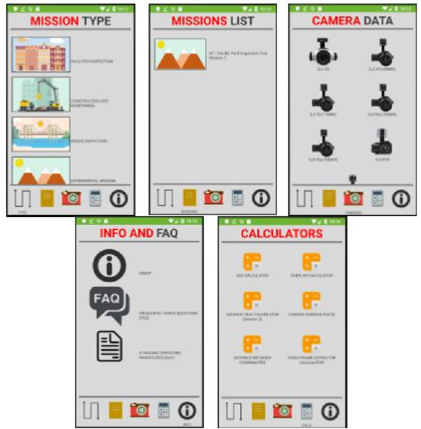

# Mission-Planner-Android-Application
The Mission Planner application is an Android-based application that would allow users to plan UAV missions to capture images for inspections, as per the user’s requirements. Users can then process these images on Pix4D to augment the inspection process.   

Commonly used flight planning applications (DJI GS Pro) do not take into consideration the user’s requirements when planning a mission. This application does not intend to replace the existing functionalities of flight planning applications, like DJI GS Pro, but rather complements their functions, by providing instructions that would guide users to generate efficient flight plans based on their inspection needs.   

The flight planning application has five main pages:   
  1. Mission Type  
  2. Missions List 
  3. Camera Data 
  4. Calculators  
  5. Information and FAQ   

The application is created using the Android Studio. The front end of the application is coded using XML (Extensible Markup Language). The back end of the application is coded using Java. The algorithms for the various calculators present in the application was derived as part of the research conducted for the B.Sc. and M.Sc. degrees.
